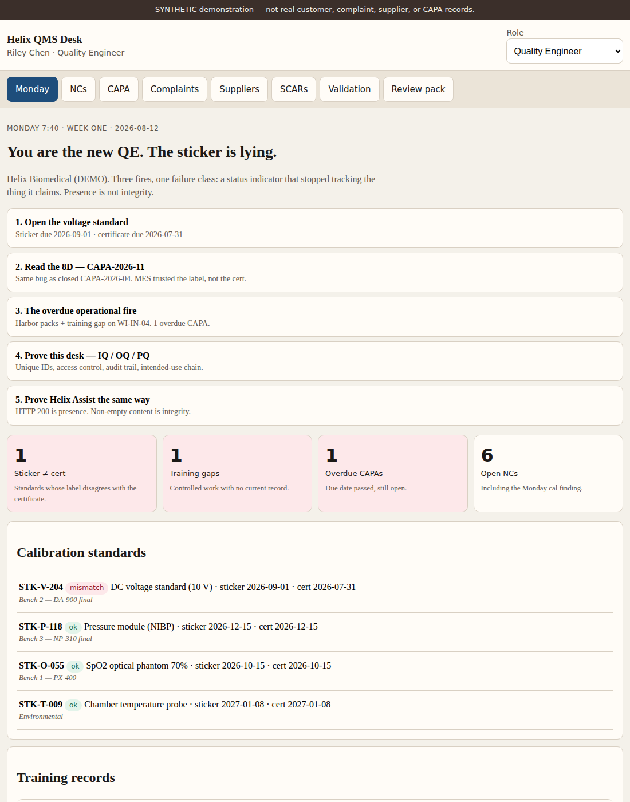

# Helix QMS Desk



## At a glance

| | |
|---|---|
| **What it is** | A working quality desk for a **fictional** biomedical test-equipment plant. Monday: sticker ≠ cert, overdue CAPA, **ISO 14971 residual that got worse after a “control”**, then IQ/OQ/PQ on the desk and an assist model. |
| **What it’s for** | Show a hiring manager **QMS + metrology + design control + CSV** in one walk — including the rule *presence is not integrity*. |
| **How to use it** | `./setup.sh` then open the URL. Follow the five Monday steps. Or open the [GitHub Pages build](https://coinupbtc.github.io/helix-qms-desk/). |

**GitHub description:** What: Monday war-room + CSV binder for a demo med-device plant (desk + assist). For: Sr QE / SQE / validation screens. How: `./setup.sh`.

> All names, lots, complaints, standards, and model logs are **synthetic**. This is not BC Group (or any real) QMS data.

## Try it

```bash
git clone https://github.com/Coinupbtc/helix-qms-desk.git
cd helix-qms-desk
chmod +x setup.sh
./setup.sh
# open http://127.0.0.1:8765/
```

Or open **[the GitHub Pages build](https://coinupbtc.github.io/helix-qms-desk/)**.

## Monday path (90 seconds)

1. **STK-V-204** — sticker due 2026-09-01, certificate due 2026-07-31. Used Friday on a DA-900 final.
2. **CAPA-2026-11** — 8D: MES lockout read the label, not the cert. Same class as closed CAPA-2026-04.
3. **CAPA-2026-09** — overdue Harbor packs; incoming done with a lapsed WI-IN-04 record.
4. **HZ-07 (ISO 14971)** — residual probability went **up** after the MES lockout. Only QA Manager can accept residual.
5. **Validation → Run desk IQ/OQ/PQ** — unique IDs, access control, audit trail, DHF chain.
6. **Run serving protocol** — HTTP 200 with empty content is a **caught failure**, not a pass.

`./scripts/smoke.sh` proves both protocols.

## What the data is (so it is not “fake empty”)

Helix Biomedical Instruments is a made-up OEM (pulse-ox simulators, defib analyzers, infusion testers). The seed is internally consistent:

| Family | Count | What you should notice |
|---|---|---|
| NCs | 17 | Warp, wrong firmware, IFU rev, **sticker ≠ cert** |
| CAPAs | 11 | One **overdue** (battery packs); new Monday 8D |
| Standards | 4 | One mismatch (STK-V-204) |
| Training | 4 | One **gap** (incoming WI expired) |
| SCARs | 6 | Late UDI-label SCAR; Harbor Battery open |
| Complaints | 10 | Field + internal; MDR line is demo-only |
| Suppliers | 8 | Certs expiring; one ASL **disqualified** (displays) |
| Hazards | 7 | One **unacceptable** residual (HZ-07); RPN is computed |
| DHF lite | 6 | User need → input → output → VE/VA; ECO-2026-021 still open |

KPIs are **computed**. Supplier score moves when you open a SCAR.

## What “validation” does

| Stage | Desk | Helix Assist |
|---|---|---|
| **IQ** | Version, seed checksum, families, SYNTHETIC banner, sticker/training/HZ-07 detect | Intended use, approved model + checksum, SYNTHETIC fixture |
| **OQ** | Permissions, empty NC blocked, audit, overdue math, residual-accept roles | HTTP 200 is presence; empty content is flagged; checksum matches ECO |
| **PQ** | Complaint → NC → CAPA → SCAR; supplier score drops | CMP-2026-019 drafts as battery-pack / major; cannot close CAPA |

Canned serving evidence runs on GitHub Pages (no GPU). Optional live probe of `127.0.0.1:8888` only works from a local `./setup.sh` server. The bakeoff tok/s figure in the fixture is **labeled demo**.

## Photos of results

| Screen | File |
|---|---|
| Monday war-room | `docs/screenshots/overview.png` |
| Sticker vs certificate | `docs/screenshots/sticker-vs-cert.png` |
| CAPA 8D | `docs/screenshots/capa-8d.png` |
| IQ/OQ/PQ + Assist | `docs/screenshots/validation.png` |
| Management review | `docs/screenshots/review-pack.png` |
| Phone (390×844) | `docs/screenshots/phone-overview.png` |

**Risk / Changes tabs (v1.3):** ISO 14971 file with HZ-07 residual worse after MES lockout; DHF lite traces ECO-2026-021. Walk them after the sticker.

## Roles (OQ)

| Role | Can do |
|---|---|
| Viewer | Read only |
| Quality Engineer | Create NC / CAPA / SCAR / complaint |
| QA Manager | Everything QE can, **plus close CAPA** |

## Resume one-liner

Built a demonstration eQMS war-room (CAPA aging, metrology sticker-vs-cert, training gaps) and executed IQ/OQ/PQ against that desk **and** a local assist model — treating HTTP 200 with empty content as a failed integrity check, not a pass. Dataset is synthetic.

## License

MIT. Do not use as a real QMS.
